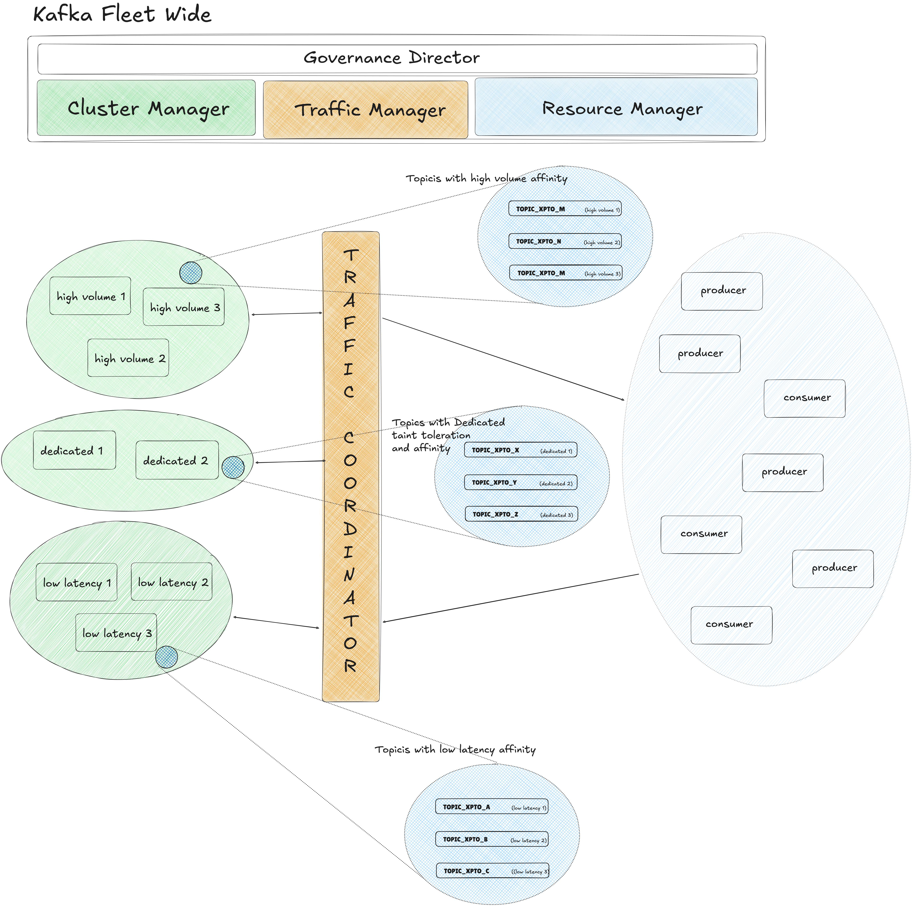

# Franz Kafka

Franz is a fleet wide Kafka cluster project that manages a pool of Kafka cluster and the Kafka topics, users and quotas, providing a topic allocation given the defined affinities among clusters and topics and a traffic control mechanism.



## The cluster manager

The cluster manager is responsible for keeping the cluster configuration given the configuration.

The kafka template
```yaml
apiVersion: kafka.franz.io/v1beta2
kind: KafkaTemplate
metadata:
  name: low-latency-kafka
spec:
  kafka:
```

The dimensions
```yaml
apiVersion: kafka.franz.io/v1beta2
kind: KafkaDimensions
metadata:
  name: country
spec:
---
apiVersion: kafka.franz.io/v1beta2
kind: KafkaDimensions
metadata:
  name: environment
spec:
---
apiVersion: kafka.franz.io/v1beta2
kind: KafkaDimensions
metadata:
  name: shard
spec:
---
apiVersion: kafka.franz.io/v1beta2
kind: KafkaDimensions
metadata:
  name: flavor
spec:
```

The kafka pool
```yaml
apiVersion: kafka.franz.io/v1beta2
kind: KafkaPool
metadata:
  name: my-pool-of-kafka
  annotations:
    kafka.franz.io/countries: "*"
spec:
  kafka:
```

## The resource manager

## The traffic manager

### The traffic coordinator 

## The governance director
